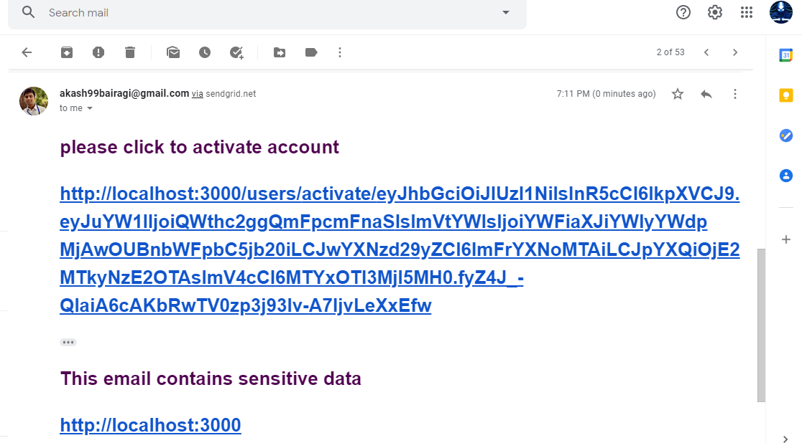

# EGuru
### EGuru is a web based Learning Management System App, created using **MERN** stack. 
It provides the most customizable and secure infrastructure to launch one’s personalized Educational website,
while facilitating effortless management of e-courses and participants.  

---

. **home page**

---
**Some of the Features :**
* Secured accounts and session using JSON web tokens and HMAC encryption.
* Facilitates instructor to create fully customizable Page look for his/her website. 
* Provides interactive UI to structure e-course contents.
* Students can explore courses and enroll into them.
* Students have classified access to the content.

  
**Building Blocks of EGuru :**
* Frontend - ReactJS
* Backend - NodeJs [ExpressJS server fraamework]
* Database Tier - MongoDB [hosted at MongoDB Atlas]

---
**peek into Eguru's secured registration and authentication process**  

  
*Account activation link, which is valid for 10 minutes, is mailed to user’ mail-ID*  

   

*Mailed link directs to Activation Page –*  

---
**internal mechanism behind the above process**  

---
**This project has not been deployed yet.**

